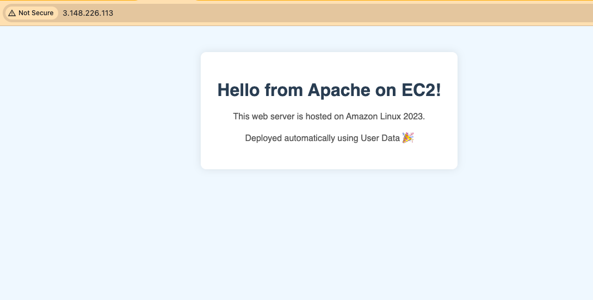

## Project inspired by [Neal K. Davis](https://www.linkedin.com/in/nealkdavis/) - AWS Cloud projects for beginner.
## Project 1 - **Create a Web Server on Amazon EC2**
- Skill level: Beginner
- Description: In this project, you will deploy an Apache Web server running on Amazon EC2 instance
- AWS Services Used: Amazon EC2

> 🚀 Deploy a custom Apache web server on Amazon EC2 with automatic provisioning via User Data.

---

## 🌐 Project Preview

A fully functional, automatically deployed web server running on Amazon EC2.  
Styled with HTML & CSS, and installed via a Bash script in EC2's user data.

🖥️ **Live Demo:** Open your EC2 Public IP in a browser  
🛠️ **Tech Stack:** AWS EC2 · Apache · Bash · Amazon Linux 2023 

---
## 🛠️ Step followed -
### **Step 1. Launch an Amazon EC2 instance**
1. Sign in to **AWS management Console**
2. Navigate to **EC2 Dashboard**
3. Click on **Launch Instance**
4. Configure the following:
    - **Name:** Custom-Apache-Web-Server1**
    - **AMI:** Amazon Linux 2023 (free tier eligible)
    - **Instance type:** - t2.macro (free tier eligible)
    - **Key pair(login):** - Select or create one
    - Enable **Auto Assign Public IP**
    - Add **Security Inbound Rules:**
        - HTTP (80) from `0.0.0.0/0`
        - SSH (22) from `My IP` 

### **Step 2. Add User Data Script**
1. Scroll to **Advanced Details** section and paste the contents of `user-data.sh`.

### **Step 3. Launch and Access**
1. Once instance is running, visit:
    `http://<your-ec2-public-ip>`
2. You should see a styled welcome page

---

## Files
### `user-data.sh`
Bash script for EC2 User data.
Installs Apache, starts the service, and deploys a custom `index.html`.
### `index.html`
Optional: The HTML file that is served by Apache. Already embedded in `user-data.sh`.

---

## 👩‍💻 Author

Prachiti Kulkarni  
Deployed using AWS + Linux + Apache